<div align="center">

<!-- Animated Cyberpunk Header Banner -->


<br/><br/>

<!-- Social Quick Navigation Buttons -->
<p align="center">
  <a href="https://shreyasvavley.me"></a>
  <a href="https://www.linkedin.com/in/shreyas-s-v-9748a1379/"></a>
  <a href="mailto:shreyasvavley@gmail.com"></a>
  <a href="https://github.com/ShreyasVavley"></a>
</p>

<!-- Dynamic Animated Typewriter -->


</div>

---

### 🚀 Engineering Command Center

```yaml
biometrics:
  name: "Shreyas Vavley"
  role: "AI Developer & Full-Stack Engineer"
  leadership: "AWS Student Builder Campus Leader (2026)"
  education: "B.E. in Computer Science & Engineering (AIML) | Sapthagiri NPS University ('28)"
  location: "Bengaluru, Karnataka, India [12.9716° N, 77.5946° E]"
  status: "🟢 Available for high-impact AI/ML & Software Engineering Roles"

current_focus:
  - "Designing Multi-Agent Autonomous Workflows using LangGraph & Agentic RAG"
  - "Building production Next.js 15 / FastAPI platforms with microservice backends"
  - "Exploring Applied Machine Learning, Edge AI, and LLM Threat Security"
```

---

### 📂 Featured Arsenal & Flagship Systems

<table>
  <thead>
    <tr>
      <th width="35%">Project</th>
      <th width="45%">Description</th>
      <th width="20%">Tech Stack</th>
    </tr>
  </thead>
  <tbody>
    <tr>
      <td>
        <b><a href="https://github.com/ShreyasVavley/webhub-ai-platform">🌐 WebHub AI Platform</a></b><br/>
        <sub>Multi-Tenant AI Website Builder</sub>
      </td>
      <td>
        AI-driven multi-tenant SaaS website builder featuring automated design synthesis, tenant provisioning, Razorpay billing, and an interactive CMS dashboard.
      </td>
      <td>
        <code>Next.js 15</code> <code>Supabase</code> <code>TypeScript</code> <code>Razorpay</code> <code>Tailwind</code>
      </td>
    </tr>
    <tr>
      <td>
        <b><a href="https://github.com/ShreyasVavley/Public-Grievance-Portal">🏛️ Public Grievance Portal</a></b><br/>
        <sub>Civic-Tech Complaint Management</sub>
      </td>
      <td>
        Civic-tech governance platform engineered for <b>Build for Bengaluru 2.0</b> to streamline citizen complaints, automate issue triaging, and accelerate resolution cycles.
      </td>
      <td>
        <code>Next.js</code> <code>FastAPI</code> <code>PostgreSQL</code> <code>REST API</code>
      </td>
    </tr>
    <tr>
      <td>
        <b><a href="https://github.com/ShreyasVavley/nexus-stream-premium-ott-2026-v2">🎬 Nexus Stream OTT</a></b><br/>
        <sub>Cinematic Streaming Engine</sub>
      </td>
      <td>
        High-performance cinematic video platform built with a glassmorphic aesthetic, subscription state flows, and lightning-fast full-text search capabilities.
      </td>
      <td>
        <code>FastAPI</code> <code>Python</code> <code>Vanilla JS</code> <code>Glassmorphism</code>
      </td>
    </tr>
    <tr>
      <td>
        <b><a href="https://github.com/ShreyasVavley/Real-Time-Interview-Evaluator">🎙️ Real-Time Interview Evaluator</a></b><br/>
        <sub>AI Candidate Analytics System</sub>
      </td>
      <td>
        Real-time candidate evaluation application combining computer vision, speech recognition, and NLP to assess interview performance, technical clarity, and engagement.
      </td>
      <td>
        <code>Python</code> <code>OpenCV</code> <code>TensorFlow</code> <code>NLP</code> <code>FastAPI</code>
      </td>
    </tr>
    <tr>
      <td>
        <b><a href="https://github.com/ShreyasVavley/second-brain">🧠 Second Brain RAG</a></b><br/>
        <sub>Document Intelligence & Knowledge Graph</sub>
      </td>
      <td>
        Local document intelligence and semantic search engine powered by Retrieval-Augmented Generation (RAG) and dense vector embeddings.
      </td>
      <td>
        <code>FastAPI</code> <code>ChromaDB</code> <code>React</code> <code>LangChain</code> <code>Python</code>
      </td>
    </tr>
    <tr>
      <td>
        <b><a href="https://github.com/ShreyasVavley/Pro-Face-Recognition-with-DeepFace">👁️ Pro Face Recognition</a></b><br/>
        <sub>Biometric Verification System</sub>
      </td>
      <td>
        Real-time facial identification and biometric verification pipeline leveraging state-of-the-art DeepFace and OpenCV models.
      </td>
      <td>
        <code>Python</code> <code>DeepFace</code> <code>OpenCV</code> <code>Keras</code>
      </td>
    </tr>
    <tr>
      <td>
        <b><a href="https://github.com/ShreyasVavley/whatsapp-pro-analyzer">📊 WhatsApp Pro Analyzer</a></b><br/>
        <sub>Chat Analytics & Sentiment Intelligence</sub>
      </td>
      <td>
        Interactive data science dashboard transforming exported chat histories into deep visual analytics, message frequency metrics, and sentiment distribution curves.
      </td>
      <td>
        <code>Streamlit</code> <code>Pandas</code> <code>Plotly</code> <code>NLP</code>
      </td>
    </tr>
  </tbody>
</table>

---

### 🛠️ Technical Matrix & Skill Radar

<table align="center" width="100%">
  <tr>
    <td width="50%" valign="top">
      <h4>🤖 AI, Machine Learning & Vision</h4>
      <a href="https://skillicons.dev">
        
      </a>
      <br/><br/>
      <code>LangGraph</code> <code>LangChain</code> <code>ChromaDB</code> <code>DeepFace</code> <code>NLP</code> <code>RAG</code> <code>Prompt Engineering</code>
    </td>
    <td width="50%" valign="top">
      <h4>💻 Languages & Core</h4>
      <a href="https://skillicons.dev">
        
      </a>
      <br/><br/>
      <code>Python 3.12+</code> <code>Java (OOP / Swing)</code> <code>C++</code> <code>TypeScript</code> <code>SQL</code>
    </td>
  </tr>
  <tr>
    <td width="50%" valign="top">
      <h4>🌐 Full-Stack & Web Architecture</h4>
      <a href="https://skillicons.dev">
        
      </a>
      <br/><br/>
      <code>Next.js 15</code> <code>React 19</code> <code>REST APIs</code> <code>Streamlit</code> <code>Three.js</code> <code>Framer Motion</code>
    </td>
    <td width="50%" valign="top">
      <h4>☁️ Cloud, Databases & DevOps</h4>
      <a href="https://skillicons.dev">
        
      </a>
      <br/><br/>
      <code>PostgreSQL</code> <code>Supabase</code> <code>Prisma ORM</code> <code>Docker</code> <code>CI/CD Pipelines</code> <code>Linux/Bash</code>
    </td>
  </tr>
</table>

---

### 📊 System Radar & Activity Stream

<div align="center">
  <!-- Dynamic Animated Skill Radar -->
  

  <br/><br/>

  <!-- Animated Contribution Graph Snake -->
  
</div>

---

### 📜 Verified Credentials & Certifications

- 🏆 **Advanced Software Engineering** — *Walmart Global Tech (Forage)*
- 🛡️ **Cybersecurity Analyst** — *Tata (Forage)*
- 🔒 **Cyber Job Simulation** — *Deloitte Australia (Forage)*
- ☁️ **Introduction to Generative AI Studio** — *Google Cloud / Simplilearn*
- 🌐 **Introduction to Cybersecurity** — *Cisco Networking Academy*
- 🧠 **OCI 2025 AI Foundations Associate** — *Oracle University*

---

### 🤝 Connect & Collaborate

<div align="center">

  <b>Let's build something game-changing together!</b>
  <br/><br/>

  <a href="https://shreyasvavley.me">
    
  </a>
  <a href="https://www.linkedin.com/in/shreyas-s-v-9748a1379/">
    
  </a>
  <a href="mailto:shreyasvavley@gmail.com">
    
  </a>

  <br/><br/>
  

</div>
